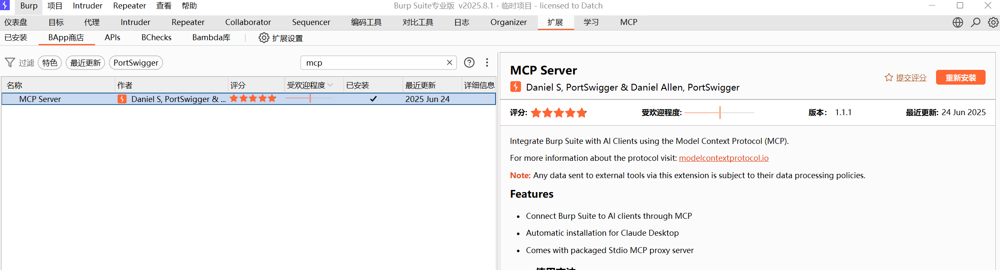
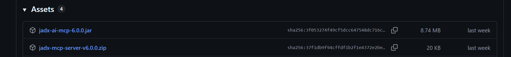
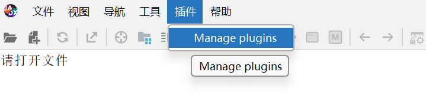
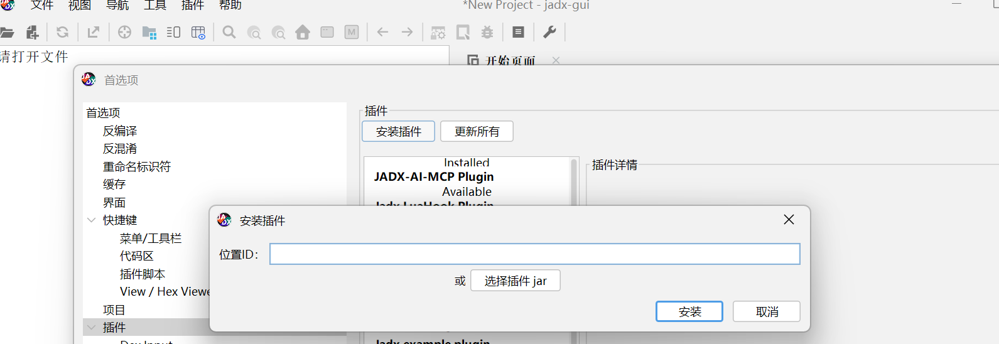
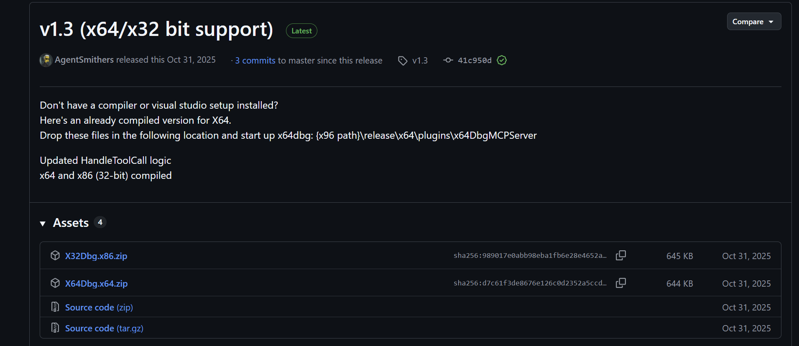
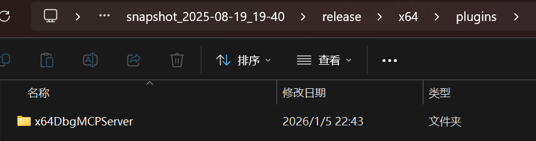
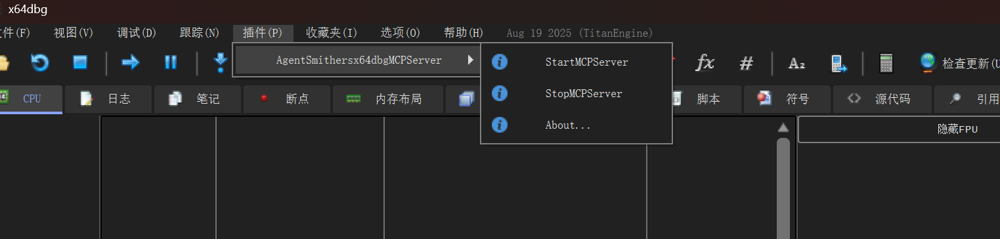
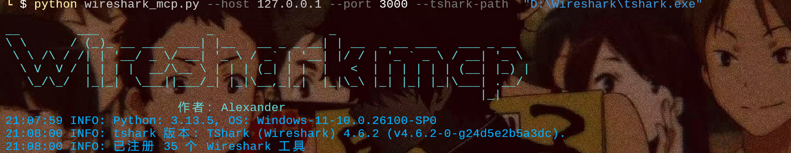
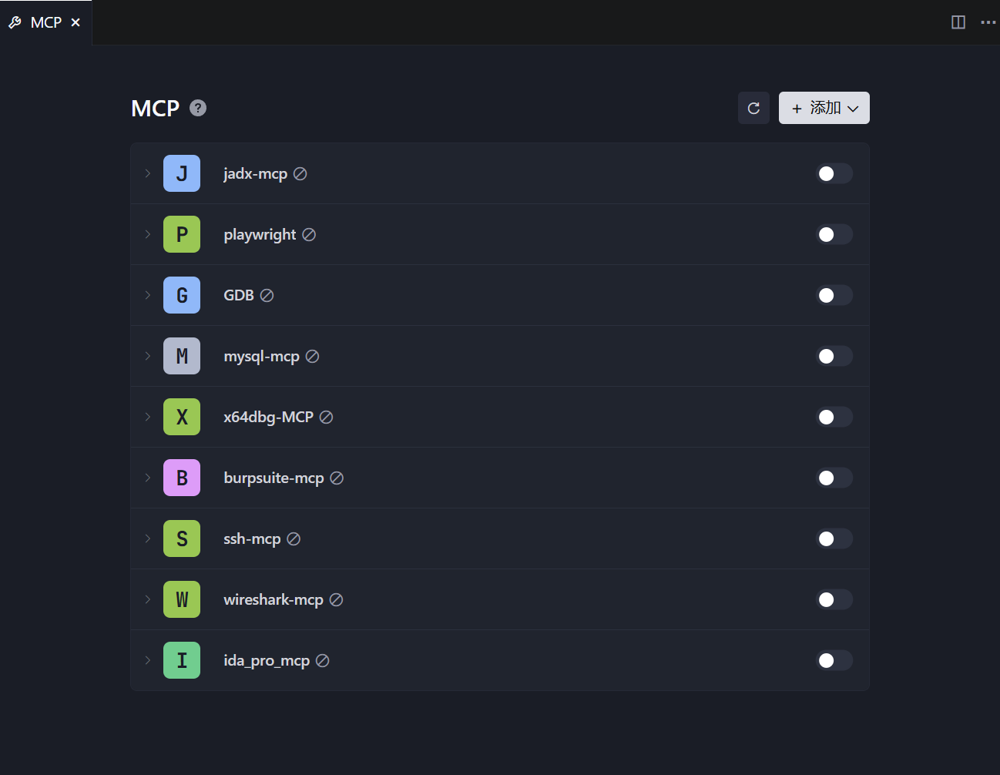

# CTF-MCP合辑-基于AI的自动化解题与分析

本文会持续更新............

曾经的CTF注重动手技能，随着的时代飞速的发展与ai自动化，我们需要适应这些变化，学会用新的东西去解题。下面是如今CTF网络安全竞赛中所有热门的mcp的配置技巧

## BurpSuite-mcp

**介绍：**BurpSuite MCP Server是一个基于 Model Context Protocol (MCP) 的服务器实现，核心功能是为 BurpSuite 提供可编程的 HTTP API 访问能力，让开发者可以通过接口调用 BurpSuite 的核心安全测试功能，无需手动操作 BurpSuite 客户端

**适用场景：**CTF竞赛所有web赛题的相关分析与操作

**项目地址：**https://github.com/portswigger/mcp-server

**配置教程：**

首先要有BurpSuitepro(建议8.1以后的版本)，直接打开bp,点击**扩展**，进入**BAapp商店**，搜索mcp并安装



安装成功，在IDE中进行json配置

```
{
  "mcpServers": {
    "burpsuite-mcp": {
      "url": "http://127.0.0.1:9876/sse"
    }
  }
}
```

## IDA_Pro_mcp

**介绍：**将 IDA Pro与 Model Context Protocol (MCP) 协议结合的组件，核心作用是为 IDA Pro 提供标准化的可编程 API 访问能力—— 你无需在 IDA Pro 图形界面手动进行逆向分析（如反汇编、函数识别、注释），而是通过 HTTP 接口 / IDE 指令调用其核心逆向功能，让二进制逆向工程更易自动化、更易集成到 MCP 全生态工具链中。

**适用场景：**CTF与取证竞赛中所有的静态逆向赛题与pwn二进制分析题

**项目地址：**https://github.com/zinja-coder/jadx-ai-mcp

**配置教程：**请移步至作者这篇文章https://www.cnblogs.com/alexander17/p/19089720

## jadx-mcp

**介绍：**结合了 Jadx 反编译工具与 Model Context Protocol (MCP) 协议的组件，核心作用是为 Jadx 这个安卓逆向分析工具提供可编程的 API 访问能力，让你可以通过代码 / 接口调用 Jadx 的核心反编译功能，而非只能手动操作 Jadx 客户端。

**适用场景：**CTF与取证竞赛中所有的安卓(app)逆向赛题与web方向中的java反编译

**项目地址：**https://github.com/zinja-coder/jadx-ai-mcp

**配置教程：**



下载这两个文件，打开jadx



选择刚刚的jar包导入即可



接着解压zip文件，在mcp项目文件夹打开终端

安装uv

```
powershell -ExecutionPolicy ByPass -c "irm https://astral.sh/uv/install.ps1 | iex"
```

创建环境

```
uv venv -p 3.11
```

激活环境

```
.venv\Scripts\activate
```

安装包

```
uv pip install httpx fastmcp
```

安装成功，在IDE中进行json配置

```
{
  "mcpServers": {
    "jadx-mcp": {
      "command": "C:\\Users\\你的用户名\\.local\\bin\\uv.exe",
      "args": [
        "--directory",
        "D:\\你的项目文件夹\\jadx-mcp-server",
        "run",
        "jadx_mcp_server.py"
      ]
    }
  }
}
```

## Playwright-mcp

**介绍：**将 Playwright 自动化测试工具与 Model Context Protocol (MCP) 协议结合的组件，核心作用是为 Playwright 提供标准化的可编程 API 访问能力—— 你无需编写原生 Playwright 代码，而是通过 HTTP 接口 / IDE 集成的方式调用 Playwright 的浏览器自动化能力，让浏览器操作更易集成、更易协作。

**适用场景：**CTF竞赛相关的web服务场景

**项目地址：**https://github.com/microsoft/playwright-mcp

**配置教程：**

安装mcp

```
npx playwright install
```

安装调用的浏览器

```
npm install -g @playwright/mcp
```

安装成功，在IDE中进行json配置

```
{
  "mcpServers": {
    "playwright": {
      "command": "npx",
      "args": [
        "@playwright/mcp@latest"
      ]
    }
  }
}
```

## GDB-mcp

**介绍：**将 GDB（GNU 调试器）与 Model Context Protocol (MCP) 协议结合的组件，核心作用是为 GDB 这款底层调试工具提供标准化的可编程 API 访问能力—— 你无需在终端手动输入 GDB 命令，而是通过 HTTP 接口 / IDE 指令调用 GDB 的调试功能，让底层程序调试更易自动化、更易集成到工具链中。

**适用场景：**CTF竞赛有关pwn二进制方向实时自动化调试获取漏洞点

**项目地址：**https://github.com/hnmr293/gdb-mcp

**配置教程：**

下载项目并解压，分别执行下面的命令

```
uv sync
uv venv
uv run server.py
```

安装成功，在IDE中进行json配置

```
{
  "mcpServers": {
    "GDB": {
      "command": "cmd.exe",
      "args": [
        "/c",
        "cd /d D:\\你的项目文件夹\\GDB-MCP && C:\\Users\\你的用户名\\.local\\bin\\uv.exe run server.py"
      ]
    }
  }
}
```

## MySQL Server-mcp

**介绍：**将 MySQL 数据库服务与 Model Context Protocol (MCP) 协议结合的组件，核心作用是为 MySQL 提供标准化的可编程 API 访问能力—— 你无需通过 SQL 客户端 / 原生驱动编写代码，而是通过 HTTP 接口 / IDE 指令调用 MySQL 的核心功能，让数据库操作更易自动化、更易集成到 MCP 生态工具链中。

**适用场景：**CTF竞赛与取证竞赛中相关的数据库操作和分析

**项目地址：**https://github.com/huangfeng19820712/mcp-mysql-server

**配置教程：**

执行命令

```
npm install @fhuang/mcp-mysql-server
```

创建.env环境

```
MYSQL_HOST=localhost
MYSQL_USER=your_username
MYSQL_PASSWORD=your_password
MYSQL_DATABASE=your_database
MYSQL_PORT=3306

CONNECTION_LIMIT=10
QUEUE_LIMIT=0
```

启动服务

```
npx @fhuang/mcp-mysql-server
```

安装成功，在IDE中进行json配置

```
{
  "mcpServers": {
    "mysql-mcp": {
      "command": "npx",
      "args": [
        "-y",
        "@fhuang/mcp-mysql-server"
      ],
      "env": {
        "MYSQL_HOST": "localhost",
        "MYSQL_USER": "your_username",
        "MYSQL_PASSWORD": "your_password",
        "MYSQL_DATABASE": "your_database"
      }
    }
  }
}
```

## x64dbg-mcp

**介绍：**将 x64dbg（一款主流的 Windows 平台二进制调试器）与 Model Context Protocol (MCP) 协议结合的组件，核心作用是为 x64dbg 提供标准化的可编程 API 访问能力—— 你无需在 x64dbg 图形界面手动点击 / 输入调试命令，而是通过 HTTP 接口或 IDE 指令调用其核心调试功能，让 Windows 平台的二进制程序调试更易自动化、更易集成到 MCP 全生态工具链中。

**适用场景：**CTF竞赛与取证竞赛中逆向赛题相关的动态调试赛题

**项目地址：**https://github.com/Wasdubya/x64dbgmcp

**配置教程：**

下载并解压项目，这篇文章有编译好的包https://www.52pojie.cn/thread-2030175-1-1.html



解压到插件文件夹下



打开软件并启动



安装成功，在IDE中进行json配置

```
{
  "mcpServers": {
    "x64dbg-MCP ": {
      "url": "http://127.0.0.1:3001/sse"
    }
  }
}
```

## SSH-mcp

**介绍：**将 SSH（安全外壳协议）工具与 Model Context Protocol (MCP) 协议结合的组件，核心作用是为 SSH 远程登录 / 操作能力提供标准化的可编程 API 访问能力—— 你无需在终端手动输入 `ssh` 命令、交互执行远程操作，而是通过 HTTP 接口 / IDE 指令调用 SSH 的核心功能，让远程服务器 / 设备操作更易自动化、更易集成到 MCP 全生态工具链中。

**适用场景：CTF竞赛与应急响应相关赛题的靶机分析与操作

**项目地址：**https://github.com/shuakami/mcp-ssh

**配置教程：**

下载并解压项目

在项目目录打开终端，分别执行下面的命令

```
npm install

npm run build
```

安装成功，在IDE中进行json配置

```
{
  "mcpServers": {
    "ssh-mcp": {
      "command": "pythonw",
      "args": [
        "D:\\你的项目目录\\bridging_ssh_mcp.py"
      ]
    }
  }
}
```

## Wireshark-mcp（暂不公开）

**介绍：**将 Wireshark与 Model Context Protocol (MCP) 协议结合的组件，核心作用是为 Wireshark 提供标准化的可编程 API 访问能力—— 你无需在 Wireshark 图形界面手动抓包、分析流量，而是通过 HTTP 接口 / IDE 指令调用其核心抓包与分析功能，让网络流量分析更易自动化、更易集成到 MCP 全生态工具链中

**适用场景：**CTF,工控，取证等系列竞赛中相关流量分析

**项目地址：**暂不公开

**配置教程：**

下载项目安装库

```
pip install -r requirements.txt
```

直接启动

```
python wireshark_mcp.py --host 127.0.0.1 --port 3000 --tshark-path  "D:\你的tshark目录\tshark.exe"
```



安装成功，在IDE中进行json配置

```
{
  "mcpServers": {
    "wireshark-mcp": {
      "url": "http://127.0.0.1:3000/sse"
    }
  }
}
```


待续...........


## 完整配置页展示



## cursor&Visual Studio Code的json一键配置代码

```
{
  "mcpServers": {
    "ida-pro-mcp": {
      "command": "D:\\你的python目录\\python311\\python.exe",
      "args": [
        "D:\\你的项目目录\\ida_pro_mcp\\server.py",
        "--ida-rpc",
        "http://127.0.0.1:13337"
      ]
    },
    "jadx-mcp": {
      "command": "C:\\Users\\你的用户名\\.local\\bin\\uv.exe",
      "args": [
        "--directory",
        "D:\\你的项目目录\\jadx-mcp-server",
        "run",
        "jadx_mcp_server.py"
      ]
    },
    "playwright": {
      "command": "npx",
      "args": [
        "@playwright/mcp@latest"
      ]
    },
    "GDB": {
      "command": "cmd.exe",
      "args": [
        "/c",
        "cd /d D:\\你的项目目录\\GDB-MCP && C:\\Users\\你的用户名\\.local\\bin\\uv.exe run server.py"
      ]
    },
    "mysql-mcp": {
      "command": "npx",
      "args": [
        "-y",
        "@fhuang/mcp-mysql-server"
      ],
      "env": {
        "MYSQL_HOST": "localhost",
        "MYSQL_USER": "your_username",
        "MYSQL_PASSWORD": "your_password",
        "MYSQL_DATABASE": "your_database"
      }
    },
    "x64dbg-MCP": {
      "url": "http://127.0.0.1:3001/sse"
    },
    "burpsuite-mcp": {
      "url": "http://127.0.0.1:9876/sse"
    },
    "ssh-mcp": {
      "command": "pythonw",
      "args": [
        "D:\\你的项目目录\\bridging_ssh_mcp.py"
      ]
    },
    "wireshark-mcp": {
      "url": "http://127.0.0.1:3000/sse"
    }
  }
}
```

# 最后

CTF-MCP系列组件，是顺应AI自动化时代浪潮、适配CTF竞赛模式变革的核心工具集合。其核心价值在于通过Model Context Protocol（MCP）协议的标准化赋能，打破了传统安全工具（如BurpSuite、IDA Pro、GDB等）的图形化操作壁垒，为各类CTF竞赛场景提供了可编程、可集成、可自动化的API访问能力，实现了从“手动操作”到“代码驱动”的效率跃迁