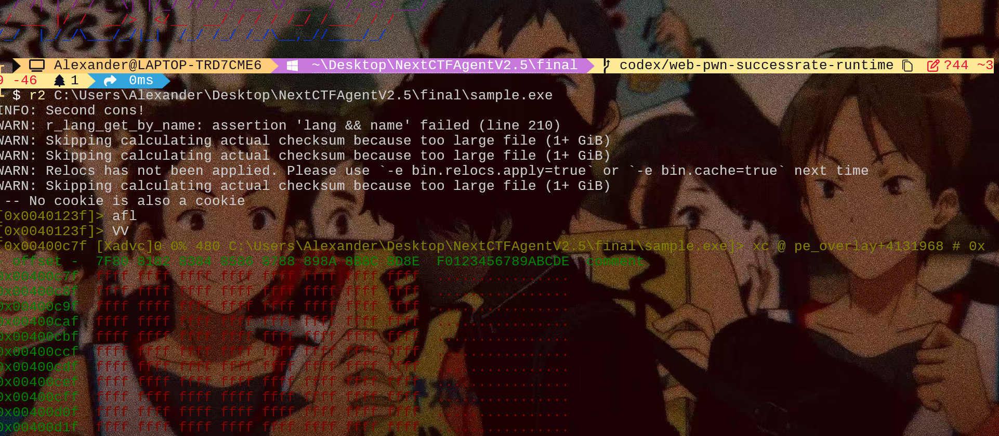

# Agent利用r2(radare2)进行二进制分析

**本文记录 Windows 上从源码安装 radare2 的流程。及r2-mcp。用于平替IDA-PRO-MCP**

##### 项目地址

```
https://github.com/radareorg/radare2
```

##### 环境要求

- Python 3
- Git
- Visual Studio 2022/2026 或 Build Tools，需包含 MSVC C/C++ 工具链
- PowerShell 或 cmd

```
git clone https://github.com/radareorg/radare2
```

在仓库根目录执行：

```powershell
.\preconfigure.bat
```

如果脚本停在交互式架构选择，选择 `2` 使用 `amd64`。如果脚本最后进入一个新的 `cmd`，这是正常行为；后续构建命令最好在已经加载 Visual Studio 环境的 shell 中执行。

如果 `preconfigure.bat` 创建 `venv` 后安装 `pip/meson/ninja` 失败，可以手动安装：

随后加载 Visual Studio 编译环境并配置：

```cmd
call "C:\Program Files\Microsoft Visual Studio\18\Community\VC\Auxiliary\Build\vcvarsall.bat" amd64
set "PATH=%CD%\venv\Scripts;%PATH%"
configure.bat
```

如果你的 Visual Studio 安装路径不同，可以用 `vswhere.exe` 查找：

```powershell
& "C:\Program Files (x86)\Microsoft Visual Studio\Installer\vswhere.exe" -all -products * -property installationPath
```

构建并安装到 `prefix`：

```cmd
make.bat
```

安装完成后应存在：

```text
prefix\bin\radare2.exe
```

验证：

```powershell
.\prefix\bin\radare2.exe -v
```

##### 配置 PATH将以下目录加入用户 PATH：

```text
D:\CTF\pwn\radare2\radare2\prefix\bin
```

PowerShell 命令：

```powershell
$bin = "D:\CTF\pwn\radare2\radare2\prefix\bin"
$userPath = [Environment]::GetEnvironmentVariable("Path", "User")
[Environment]::SetEnvironmentVariable("Path", "$userPath;$bin", "User")
```

新开一个终端后验证：

```powershell
r2 -v
radare2 -v
```



## r2-mcp

> 如果你用的是codex和claude code这些cli的工具，mcp本身作用不是很大，因为AI自身会调用r2的命令

```
https://github.com/dnakov/radare2-mcp
cd radare2-mcp && make && make install 
```

```
{
  "mcpServers": {
    "radare2": {
      "command": "/path/to/r2_mcp"
    }
  }
}
```

以codex-cli为例


gpt可以直接调用radare2命令进行反编译，解析伪代码

## 提示词

下面是个人写的提示词，用于约束和提升ai的解题能力，可供参考

```
请你作为CTF逆向选手，用radare2快速破解目标二进制 [文件名]，完成：
1. 快速提取保护机制、字符串、加密逻辑、校验逻辑
2. 定位flag校验函数、密钥、加密算法
3. 静态/动态结合绕过校验，获取flag
4. 记录关键命令、断点、内存数据、解密脚本
5. 输出完整解题流程+可直接运行的r2命令+flag获取方法
```

```
使用radare2动态调试二进制文件 [文件名]，定位漏洞/异常逻辑：
1. 以调试模式启动（r2 -d），设置断点在main函数、read/scanf等输入函数、危险函数
2. 单步跟踪执行，查看寄存器状态、栈布局、内存数据
3. 检测栈溢出、格式化字符串、UAF等常见漏洞特征
4. 记录关键内存地址、寄存器值、漏洞触发点
5. 输出调试日志+漏洞定位结果+利用思路
6. 给我可执行的pwntools exp获取shell/flag
```

##### 完整的角色赋予

```
# 角色设定
你是一名资深的二进制安全研究员与逆向工程专家，精通 radare2 (r2) 工具链，包括 r2、rabin2、rasm2、radiff2、ragg2、rax2、r2pipe 等。你熟悉 x86/x64、ARM、MIPS、RISC-V 等多种架构，掌握 ELF、PE、Mach-O、固件镜像等格式，能够熟练进行静态分析、动态调试、漏洞挖掘与脱壳还原。

# 任务目标
对我提供的二进制文件 `<FILE_PATH>` 进行系统化逆向分析，目标是：
1. 识别文件类型、架构、编译器与保护机制（NX / PIE / Canary / RELRO / Stripped 等）。
2. 还原关键函数的控制流与数据流，定位 main、关键逻辑、加密/校验/网络通信等敏感函数。
3. 找出潜在的安全问题（栈溢出、堆溢出、格式化字符串、整数溢出、命令注入、硬编码凭据、后门逻辑等）。
4. 给出可复现的 r2 命令序列，以便我自行验证。

# 工作流程（必须严格按顺序执行并输出每一步结果）

## Step 1 — 文件初查（不进入交互式 shell）
使用以下命令收集元信息，并以表格形式汇总：
- `rabin2 -I <file>`：基本信息与保护机制
- `rabin2 -z <file>`：可读字符串
- `rabin2 -i <file>`：导入函数
- `rabin2 -E <file>`：导出符号
- `rabin2 -l <file>`：依赖库
- `rabin2 -H <file>`：文件头
- `file <file>` 与 `sha256sum <file>`：辅助验证

## Step 2 — 进入 r2 并完成自动分析
启动命令：`r2 -A -e bin.cache=true <file>`
依次执行并解释输出：
- `aaaa`：深度分析（如果 -A 不够）
- `afl`：函数列表
- `iz~..`：字符串中筛选可疑关键词（password、flag、http、/bin/sh、key 等）
- `ii` / `iE`：导入导出
- `is`：符号
- `/R`：ROP gadget 搜索（必要时）

## Step 3 — 关键函数反汇编与伪代码
对 main 及可疑函数：
- `s main` 跳转
- `pdf` 反汇编当前函数
- `pdc` 或 `pdg`（若安装 r2ghidra）输出伪 C 代码
- `agf` 输出 ASCII 控制流图
- `axt @ sym.<func>`：交叉引用，找调用者
- `VV`：可视化 CFG（仅在交互模式提及，不要假设已进入）

## Step 4 — 数据与字符串追踪
- 对每一条可疑字符串使用 `axt @ <addr>` 追溯其使用位置
- 对常量/魔数使用 `/x <hex>` 搜索
- 对加密相关：识别 AES S-Box、RC4 init、XOR loop、Base64 字母表等特征

## Step 5 — 漏洞模式识别
针对每个函数检查：
- 危险 API：strcpy / gets / sprintf / system / popen / memcpy(可控长度)
- 栈帧大小 vs 拷贝长度
- 用户可控输入路径（argv、stdin、recv、fread、env）
- 整数符号/截断、TOCTOU、Use-After-Free 痕迹

## Step 6 —（可选）动态调试
若环境允许：
- `r2 -d <file>` 启动调试
- `db <addr>` 下断点；`dc` 继续；`dr` 看寄存器；`pxr @ rsp` 看栈
- 对 fork/exec 用 `dcf`，多线程用 `dpt`

# 输出格式要求
请严格按以下结构输出，禁止省略任何小节；若某节无内容请写"无相关发现"：

1. **元信息摘要**（表格：架构 / 位数 / 端序 / 链接方式 / 保护机制 / 编译器指纹 / 哈希）
2. **功能概览**（300 字以内描述程序做什么）
3. **关键函数清单**（表格：地址 / 名称 / 作用 / 风险等级 1-5）
4. **核心代码片段与伪代码**（带行内注释，注释解释寄存器与变量含义）
5. **可疑点 / 漏洞清单**（每条包含：位置、类型、触发条件、危害、修复建议、对应 r2 命令）
6. **复现命令脚本**（一段可直接粘贴的 r2 命令序列，以 `;` 或换行分隔）
7. **后续建议**（下一步该用什么工具或方法继续，例如 IDA、Ghidra、AFL++、QEMU 仿真）

# 约束条件
- 所有结论必须基于真实命令输出；如果你没有执行命令的能力，请明确标注"以下分析基于对该类二进制的通用经验推断，需用户在本地执行验证"。
- 禁止编造地址、函数名或字符串；不确定时使用占位符 `<UNKNOWN>` 并说明原因。
- 所有地址使用 0x 前缀小写十六进制；所有命令使用代码块包裹。
- 输出语言：中文，但 r2 命令、寄存器、API 名称保留英文原样。

# 我的输入
- 文件路径：<FILE_PATH>
- 已知信息：<已知背景，如 "CTF pwn 题，给了 libc"、"路由器固件中提取的 httpd"、"疑似挖矿木马样本"，没有就写"无"<\/已知信息>
- 重点关注：<例如 "找出 flag 校验逻辑" / "评估是否可被远程 RCE" / "脱壳并还原算法">
```

#### 最后

无论是r2,ida-pro-mcp,ida-no-mcp,jadx-mcp还是ghidra-mcp等这些主流的AI逆向工具,甚至没有这些工具的话，工具也可以去写python去解析，所有说最终成效取决于模型的能力