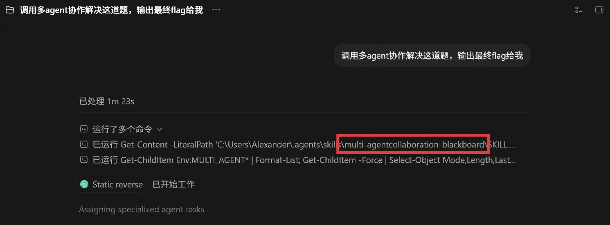
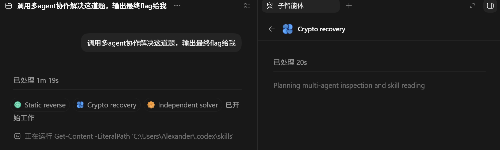

# 从“并行调用”到“可验证协作”：为什么多 Agent 需要一块共享板块

**项目地址：**https://github.com/Alexander17-yang/multi-agentcollaboration-blackboard

**写在前面：**这个skills也是最近打ctf比赛中发现ai解题时候出现的一些问题去写的，在评测腾讯智能渗透agent评分上，我发现nextctf-agent在第一轮解题上，由于上下文的限制，在多agent协作中总是遗忘前面上文的重要内容，参考雪殇师傅的项目，我想了一下，如果写一个skills能让aiagent提取共享重要的知识板块，然后集中在一个模块上，是不是就很方便开多线程去ctf解题，所有multi-agentcollaboration-blackboard这个skills就来了，第二轮在nextctf-agentV2.5上使用这个方法运用deepseek多agent协作成功比

第一轮高了30%的评分点。


## 正文

当我们第一次把一个任务拆给多个 Agent 时，最直观的做法通常是：让它们并行工作，然后把结果收集回来。这个方法在任务很短、分支完全独立时足够有效；但一旦任务持续时间变长、存在共享资源，或者结论之间会相互依赖，“多开几个Agent”很快就会暴露出协作层面的缺口。

一个 Agent 已经尝试并排除了某条路线，另一个 Agent 却因为看不到历史状态而重新走了一遍；多个 Agent 同时执行昂贵扫描或构建；某个未经验证的猜测被复制进后续提示，最终变成团队默认接受的“事实”；旧 Worker 在租约过期后仍然提交结果，覆盖了新 Owner 的结论；一个关键发现只存在于即时消息里，Agent 一旦退出就很难被后来者复用。

这些问题说明：**并行计算不是协作本身。** 多 Agent 系统除了执行能力，还需要一个共享的状态层，用来回答几个基本问题：我们已经知道什么？哪些结论真正被验证过？哪些方向已被充分排除？当前是谁在负责什么？哪些操作不能并发执行？Multi-agentcollaboration-blackboard -skills正是围绕这些问题设计的。


### 两个平面，而不是一个万能通信层

这个项目没有试图用 SQLite 取代 Agent 调度工具，也没有把 Blackboard 设计成聊天室。它将协作拆成两个互补的平面。

第一个是**原生控制平面**：负责创建 Agent、分配子任务、发送即时消息、处理中断和收集最终回答。这类信息要求低延迟，并且与 Agent 的生命周期紧密相关。

第二个是**Blackboard 状态平面**：负责保存事实、失败路径、工作意图、审查结果和分支假设。它关注的不是“谁刚刚说了什么”，而是“哪些状态值得在 Worker退出后继续存在”。

**说白一点，blackboard共享的是各个子agent之间最重要的知识的输送**


## 多 Agent 如何协作

- **candidate** 表示假设、推断、解释，或者当前 Worker 尚未亲自复现的报告；
- **verified** 表示直接观察、可重复执行并带有足够来源信息的结果；
- **challenged** 表示该事实暂时不能继续作为前提；
- **rejected、merged、superseded、retired** 表示事实只保留审计价值，不再参与
  当前推理。

这种区分可以阻止一个常见的协作退化：某个 Agent 的猜测被另一个 Agent 引用，随后又被第三个 Agent 当作已确认事实。Blackboard 不会让“被重复转述”自动变成“被验证”。

有效的**Dead End**不是一句“试过了，不行”，而应该包含作用域、测试集合、观察到的不变量以及重新开启这条路线的条件。

## Intent：谁负责一个方向，Activity：避免重复昂贵工作，Resource：真正需要互斥的对象

Activity 解决浪费问题，Resource 解决正确性与冲突问题。一个 Worker 可以同时拥有 Intent、Activity 和 Resource，但必须在工作结束时分别清理。


## 工作流程

```
SYNC → OWN → EXECUTE → PUBLISH → CLOSE
```


## 适用场景

这套模式并不限于安全任务。它适用于任何具有并行分支、共享证据或共享资源的长任务：

- 多 Agent 阅读大型代码库并分别实现、测试和 Review；
- 研究型任务中的文献检索、证据核验和观点冲突处理；
- Debugging 中的假设分支、复现步骤和失败路径共享；
- 事件响应中的日志分析、主机检查和独占操作控制；
- CTF、Pentest 或逆向分析中的扫描去重、路线剪枝和凭据复用；
- 数据分析流水线中的查询分工、构建缓存和结果验证。

**注**：这套协作适用于复杂的任务，简单的任务可能会浪费不必要的资源


同时这个也试用于codex，claudecode，cursor等agent中





## 最后

多 Agent 系统真正困难的部分，往往不是让更多模型同时运行，而是让它们在长时间、不完整信息和并发状态下仍然形成一致、可追踪的工作结果。
