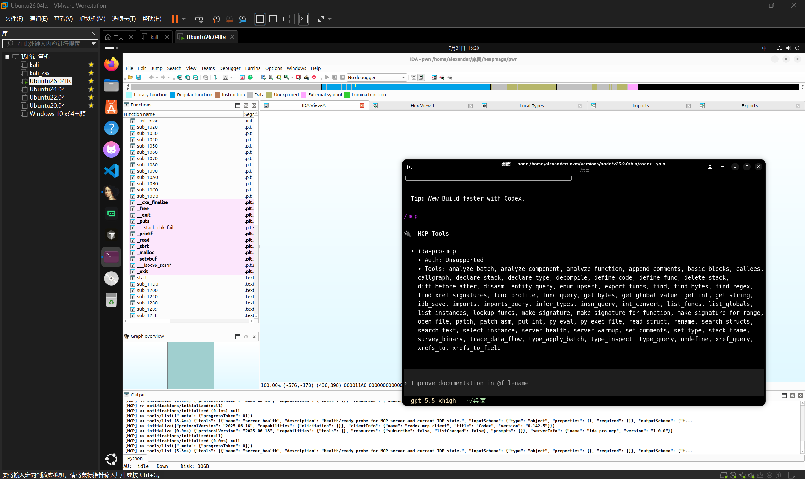
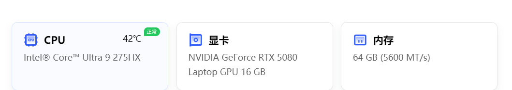
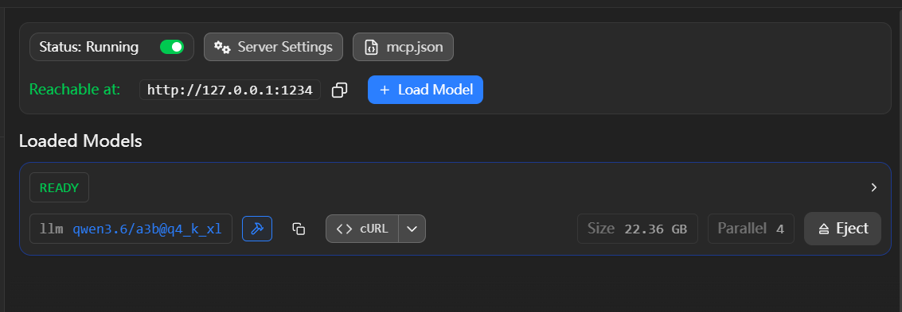
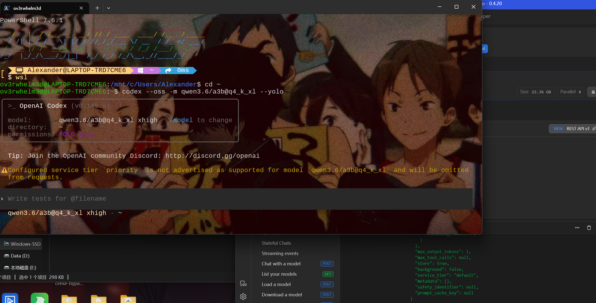

# How to compete in online and offline CTFs in the AI era

## online线上赛

**写在前面**：鄙人没钱，用不太起claude，所以非特殊情况不会去用claude,下文默认用GPT模型，那又有人问了，为什么不用国产模型，1.国产不比gpt，claude这些模型便宜  2.国产在榜单排名高，你看看是什么榜，编程能力强不代表安全能力强

**正片环节：**

进入正题，首先我们知道CTF有5大方向，我们先撇去misc，因为你用ai去解misc估计都没你手快，而且有的ui工具ai也没法调用。

web可以直接用windows的codex去跑；密码高版本的sagemath,reverse和pwn的动调在windows不好操作，建议装wsl或者VMware虚拟机。


这里推荐的skills https://skills.sh/?q=ctf (遇到难的题目建议把skills关了，没必要每次压缩上下文都加载读一次skills)

mcp只推荐kali-mcp,ida-pro-mcp,jadx-mcp;其他建议全关了，没有必要

另外除了gpt5.4，不然你做题需要绕过安全限制https://github.com/MDX-Tom/gpt-5.6-instruct


剩下的怎么做题，相信各位都会，直接打开codex-cli或者codex desktop把整个题目甩给它让他开始写就可以了


我又想写pwn,又想re怎么办，ida-pro-mcp只能读一个文件啊，那就本机开一个，剩下的开虚拟机（做几题开几个）呗




## offline线下赛

估计大家想看是线下断网怎么打

我先把我配置放前面



我们依旧用codex,而且只建议用codex，Claudecode为什么不用（因为卡的要死），为什么不用自己写的或者其他开源的？（有现成的你不用？偏要自己去写不知道能不能用的shit，和一堆照着codex模仿出来的产品？）

**下面是环境**

skills:不需要
mcp:不需要（你觉得你电脑够牛逼配置够好，模型上下文能拉很大可以启动线上的那些的mcp工具）

rag知识库可以但不推荐

总结就是能别装就别装，不然你的电脑加载模型和吐字慢的要死！只要

```
wsl + codex +lmstudio
```

为什么是wsl,因为objump这些工具window调用不了

模型要求根据自己的电脑配置去选（我是qwen3.6-a3b-35b-q4-k-m),不要选什么越狱的模型（二次训练的模型容易陷入死循环，官方的模型道德本来就不是很高绕一下就过去了）


### 过程

加载lmstudio



或者

```
lms server start --port 1234
```

然后 `--oss` 参数以将其指向 LM Studio

```
codex --oss
```

`--yolo`为自动执行任务

codex可能会占用很长的上下文，所以启动模型需要拉较大上下文



完整命令

```
codex --oss -m qwen3.6/a3b@q4_k_xl(模型id)
```

####  ollama(不推荐)

写到~/.codex目录下的config.toml中

```
[model_providers.local_ollama]
name = "Ollama"
base_url = "http://localhost:11434/v1"
```

#### claude code(不推荐)

写到~/.claude目录下的settings.json中

```
{
  "env": {
    "ANTHROPIC_BASE_URL": "http://localhost:1234",
    "ANTHROPIC_AUTH_TOKEN": "lmstudio",
    "CLAUDE_CODE_ATTRIBUTION_HEADER": "0"
  },
  "skipDangerousModePermissionPrompt": true
}
```

启动

```
claude --model qwen3.6/a3b@q4_k_xl(模型id)
```

